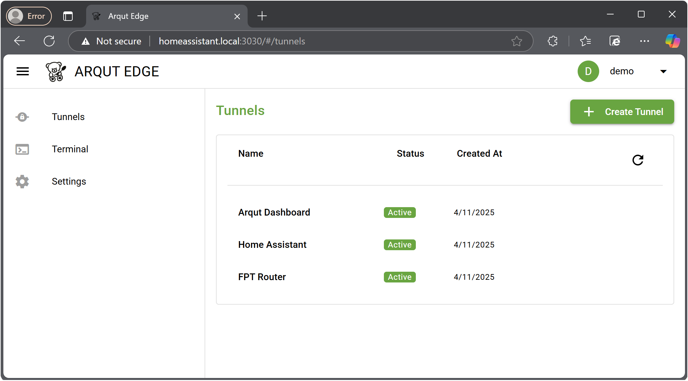

# Home Assistant Community Add-on: Arqut Edge Application

![Supports aarch64 Architecture][aarch64-shield]
![Supports amd64 Architecture][amd64-shield]
![Supports armv7 Architecture][armv7-shield]
![Supports i386 Architecture][i386-shield]

The Arqut Edge add-on enables you to expose your internal web services securely through tunnel connections.

## About

This add-on provides a simple and secure tunnel service, allowing you to publish internal network services and access them remotely over the internet. With one-click installation and seamless integration into Home Assistant, you can easily make your local services or IoT devices accessible from anywhere — no public IP required.

[:books: Read the full add-on documentation][docs]

## Support

Got questions?

Please [open an issue here][issue] GitHub.

Thank you for being involved! :heart_eyes:

[aarch64-shield]: https://img.shields.io/badge/aarch64-yes-green.svg
[amd64-shield]: https://img.shields.io/badge/amd64-yes-green.svg
[armv7-shield]: https://img.shields.io/badge/armv7-no-red.svg
[docs]: https://github.com/tphan267/tunnel-addon/blob/main/DOCS.md
[i386-shield]: https://img.shields.io/badge/i386-no-red.svg
[issue]: https://github.com/tphan267/tunnel-addon/issues
